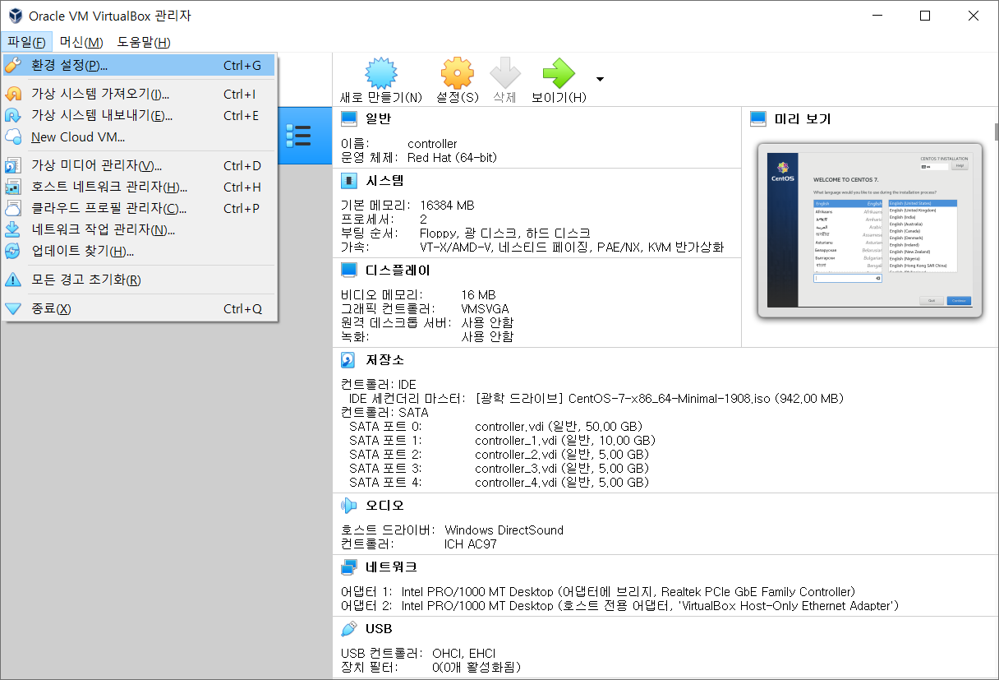

# VirtualBox 사용 가이드

새로 `virtualbox`를 설치하신 분들은 순서대로 진행해주세요.

기존에 virtualbox를 가지고 계신분들은 ova파일 로드 후 `NatNetwork` 활성화 상태 확인 후 생성해주세요.

편의상 NatNetwork의 네트워크 대역은 `10.0.2.0/24` 으로 통일해주세요.

## 1. VirtualBox 설치

### [다운로드 홈페이지](https://www.virtualbox.org/wiki/Downloads)

### 다운로드 링크

- Windows : https://download.virtualbox.org/virtualbox/6.1.10/VirtualBox-6.1.10-138449-Win.exe
- Mac : https://download.virtualbox.org/virtualbox/6.1.10/VirtualBox-6.1.10-138449-OSX.dmg
- Linux : https://www.virtualbox.org/wiki/Linux_Downloads

## 2. VirtualBox Extension Pack 설치(권장)

VirtualBox 설치 후 Extensin Pack 설치

- https://download.virtualbox.org/virtualbox/6.1.10/Oracle_VM_VirtualBox_Extension_Pack-6.1.10.vbox-extpack

## 3. ova 파일 불러오기

## 4. NAT Network 설정

### 1) VirtualBox 환경설정

- [파일] - [환경설정]

### 2) Net Network 목록 확인

> 참고 : Nat Network 목록이 있을 경우 추가 또는 네트워크 대역 수정

- [네트워크] 

### 3) NAT Network 추가

- [네트워크] - [추가]

### 4) NAT 네트워크 정보 확인

- NAT 네트워크 정보 확인

> 수업에서 10.0.2.0/24 대역 사용 예정

