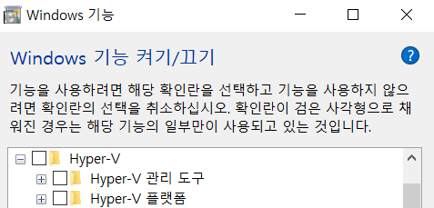

# Windows 10에서 Hyper-V 문제 해결

## 방법1 : 명령 프롬프트(CMD)에서 삭제 방법

`Windows Key + X` 누른 후 `A`를 눌러 "명령 프롬프트(관리자)"를 실행 후 아래 명령어를 실행한다.
```cmd
DISM /Online /Enable-Feature /All /FeatureName:Microsoft-Hyper-V
```

## 방법2 : PowerShell에서 삭제 방법

`Windows Key + X` 누른 후 `A`를 눌러 "명령 프롬프트(관리자)"를 실행 후 명령 프롬프트 창에서 powershell 입력하여 PowerShell로 전환 후 아래 명령어를 실행한다.
```powershell
Disable-WindowsOptionalFeature -Online -FeatureName Microsoft-Hyper-V-All
```

## 방법3 : Windows 기능 켜기/끄기

`Windows Key + R` 누른 후 실행 창에서 `OptionalFeatures` 입력하여 `"Windows 기능 켜기/끄기"`를 실행한다.

화면에서 아래 이미지처럼 Hyper-V 항목을 선택 후 "OK" 누른다.

