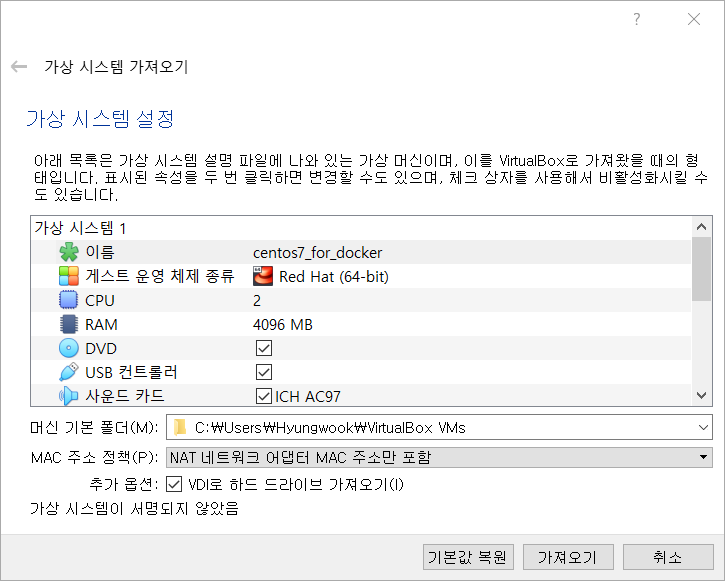
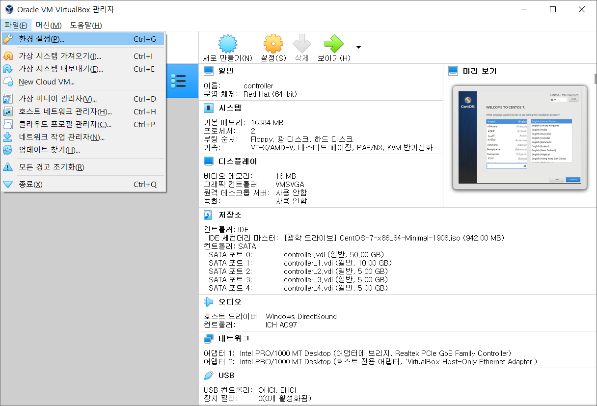

# VirtualBox 사용 가이드

새로 `virtualbox`를 설치하신 분들은 순서대로 진행해주세요.

기존에 virtualbox를 가지고 계신분들은 ova파일 로드 후 `NatNetwork` 활성화 상태 확인 후 생성해주세요.

편의상 NatNetwork의 네트워크 대역은 `10.0.2.0/24` 으로 통일해주세요.

## 설치

## ova 파일 불러오기

## NAT Network 설정

### 1. VirtualBox 환경설정

- [파일] - [환경설정]

### 2. Net Network 목록 확인

> 참고 : Nat Network 목록이 있을 경우 추가 또는 네트워크 대역 수정

- [네트워크] 

### 3. NAT Network 추가

- [네트워크] - [추가]

### 4. NAT 네트워크 정보 확인

- NAT 네트워크 정보 확인

> 수업에서 10.0.2.0/24 대역 사용 예정

